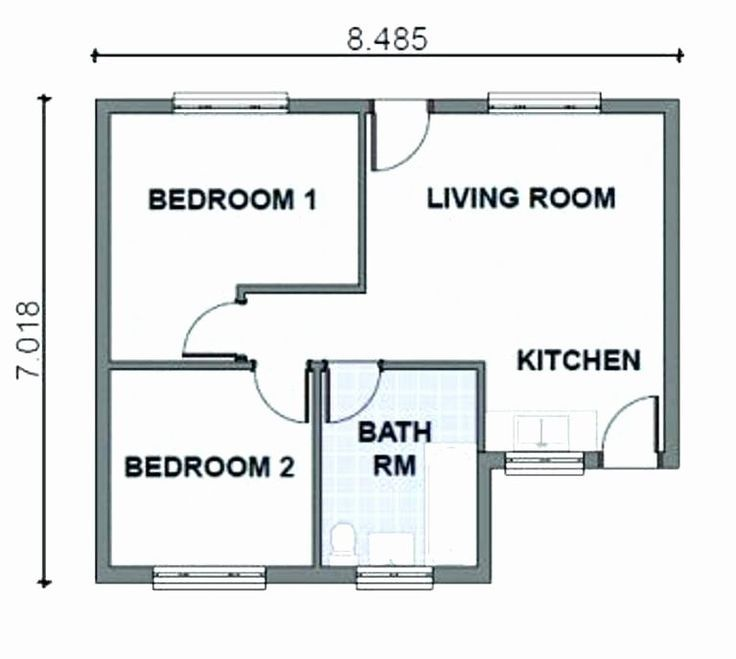
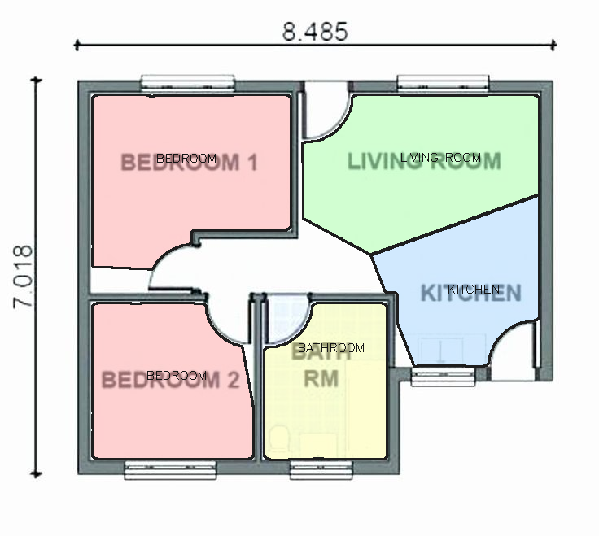
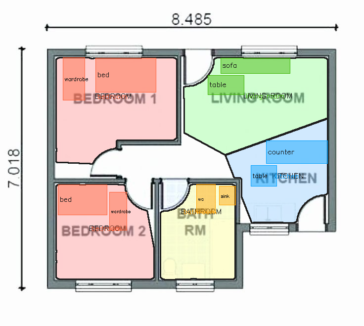
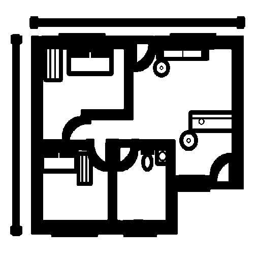

# FloorPlan AI — Automated 2D to 3D Floor Plan Visualization

An end-to-end computer vision pipeline that takes a 2D architectural floor plan image and produces a photorealistic 3D isometric render with furniture placed in every room.

**Input:** Any standard 2D architectural floor plan (JPG/PNG)  
**Output:** Colour-coded room map → furnished plan → isometric 3D render

---

## Demo
| Input Floor Plan | Room Detection | Furniture Placing | Furnished Plan | 3D Render |
|:-:|:-:|:-:|:-:|:-:|
|  |  |  |  |  |

---

## Pipeline

```
Input floorplan.jpg
       │
       ▼
┌─────────────────────────────────────────────────────────────┐
│  1. Multi-pass OCR  (Tesseract, 5 preprocessing variants)   │
│     Extracts room labels at any scale, contrast, font size  │
├─────────────────────────────────────────────────────────────┤
│  2. Wall Extraction  (adaptive threshold + morphology)       │
│     Isolates wall geometry, strips text noise blobs         │
├─────────────────────────────────────────────────────────────┤
│  3. Room Segmentation  (OCR-anchored Voronoi flood fill)     │
│     Seeds from OCR text positions → Voronoi split for       │
│     open-plan layouts → closed room masks per label         │
├─────────────────────────────────────────────────────────────┤
│  4. Room Classification  (OCR label map + normalisation)     │
│     Maps "BATH RM", "LIVING ROOM", "WIC" → canonical types  │
├─────────────────────────────────────────────────────────────┤
│  5. Furniture Placement  (wall-constrained, non-overlapping) │
│     Scale-relative sizing, sequential mask subtraction,     │
│     wall-touching preference per item                       │
├─────────────────────────────────────────────────────────────┤
│  6. Architectural Symbol Drawing                             │
│     Generates standard floor plan symbols (bed, sofa,       │
│     table, WC, sink, counter, wardrobe) at exact positions  │
├─────────────────────────────────────────────────────────────┤
│  7. ControlNet + Stable Diffusion Render                     │
│     Canny edges from symbol drawing → ControlNet guidance   │
│     → Stable Diffusion v1.5 → photorealistic 3D render      │
└─────────────────────────────────────────────────────────────┘
       │
       ▼
colored_plan.png  +  furnished_plan.png  +  isometric_render.png
```

---

## Technical Highlights

**OCR — Multi-pass Tesseract**  
Runs 5 preprocessing variants (original, 2× upscale binary, 2× Otsu, 3× Otsu, CLAHE + Otsu) with 3 PSM modes each. Merges adjacent tokens into multi-word labels ("LIVING" + "ROOM" → "LIVING ROOM"), deduplicates by spatial grid bucket so two BEDROOMs on the same plan each get their own seed.

**Room Segmentation — Voronoi Flood Fill**  
Instead of distance-transform thresholding, each free pixel is assigned to its nearest OCR seed by Euclidean distance (Voronoi partition). This correctly splits open-plan layouts (Kitchen + Living Room sharing one connected region) without needing a wall between them. Morphological closing seals door gaps before segmentation so rooms don't bleed through doorways.

**Furniture Placement — Sequential Mask Subtraction**  
Furniture items are placed one at a time. After each placement, occupied pixels plus a 4px clearance pad are removed from the available room mask — making overlap geometrically impossible for the next item. Sizes are proportional to the room's bounding box so furniture scales correctly across different plan resolutions.

**3D Render — ControlNet Canny**  
Architectural line drawings (walls + standard furniture symbols) are passed to ControlNet Canny which guides Stable Diffusion v1.5. Furniture is drawn as proper architectural symbols (bed with headboard, sofa with back rest and arm rests, table with diagonal cross, WC with tank and oval bowl) — the same conventions ControlNet was trained on, ensuring accurate furniture rendering.

---

## Project Structure

```
floorplan-ai/
├── src/floorplan/
│   ├── ocr.py           # Multi-pass Tesseract label extraction
│   ├── walls.py         # Adaptive threshold + conditional dilation
│   ├── segment.py       # Voronoi flood-fill room segmentation
│   ├── classify.py      # OCR label normalisation + room colouring
│   ├── furniture.py     # Scale-aware wall-constrained placement
│   ├── draw_symbols.py  # Architectural furniture symbol drawing
│   └── render.py        # ControlNet + Stable Diffusion pipeline
├── tests/
│   └── test_segment.py  # pytest unit tests
├── config.yaml          # All parameters — no magic numbers in code
├── main.py              # CLI entry point
└── requirements.txt
```

---

## Quickstart

```bash
# 1. Install system dependency
sudo apt-get install tesseract-ocr   # Linux
# brew install tesseract             # macOS
# Download from UB Mannheim          # Windows

# 2. Clone and install
git clone https://github.com/Janavee01/floorplan.git
cd floorplan
pip install -r requirements.txt

# 3. Run — room detection + furniture placement
python main.py --input floorplan.jpg

# 4. Run with full 3D render (requires GPU, ~20 min on GTX 1650)
python main.py --input floorplan.jpg --render

# 5. Tests
pytest tests/ -v
```

**Outputs** saved to `assets/`:

| File | Description |
|---|---|
| `walls_no_text.png` | Cleaned binary wall mask |
| `colored_plan.png` | Rooms colour-coded by type |
| `furnished_plan.png` | Furniture overlaid on coloured plan |
| `line_drawing.png` | Architectural line art fed to ControlNet |
| `isometric_render.png` | Final 3D photorealistic render |

---

## Configuration

Every parameter lives in `config.yaml`:

```yaml
segmentation:
  gap_ratio: 0.02       # door gap sealing — fraction of image size

render:
  image_size: 512
  num_inference_steps: 30
  guidance_scale: 7.5
  controlnet_conditioning_scale: 1.0
  seed: 42
```

---

## Tech Stack

| Component | Technology |
|---|---|
| OCR | Tesseract 5 + pytesseract |
| Image processing | OpenCV 4.8 |
| Room segmentation | Custom Voronoi flood-fill |
| Deep learning | PyTorch 2.0 |
| Generative render | Stable Diffusion v1.5 |
| Layout guidance | ControlNet Canny |
| Model serving | HuggingFace Diffusers |
| Config | YAML |
| Testing | pytest |

---

## Supported Room Types

`bedroom` · `living_room` · `kitchen` · `bathroom` · `dining_room` · `utility` · `corridor`

Label variants handled: "BATH RM", "WIC", "LIVING ROOM", "MASTER BEDROOM", "EN SUITE", "W.C.", "SITTING ROOM", and 40+ others.

---

## Roadmap

- [x] Multi-pass OCR with noise filtering and token merging
- [x] Wall extraction with conditional dilation
- [x] Voronoi flood-fill room segmentation
- [x] Scale-aware furniture placement with overlap prevention
- [x] Architectural symbol drawing for ControlNet input
- [x] ControlNet + Stable Diffusion 3D render pipeline
- [ ] Streamlit web app — upload and visualise in browser
- [ ] CLIP zero-shot fallback for unlabelled rooms
- [ ] Scale calibration from dimension annotations
